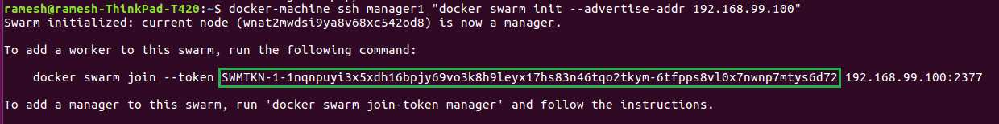
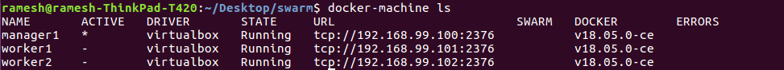
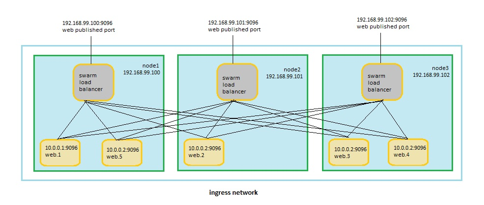
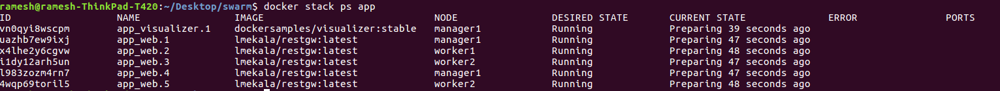

# Running Mashling on docker swarm
This recipe will walk you through creating a Docker image out of your Mashling gateway and creating the files needed to deploy to docker swarm. For detailed information on docker swarm refer [here](https://docs.docker.com/get-started/part4/)

### Prerequisites
For this scenario to work you'll need the following prerequisites installed:
* Docker Engine 1.12 or later, Docker compose and Docker machine installed (and an account for Docker Hub)
* Virtual box installed

* Docker :
    For this scenario we'll make use of [Docker Hub](https://hub.docker.com) to push the images to so that the docker swarm cluster can access them. To make sure you can push your images to Docker Hub you'll need to:
    * Register at [Docker Hub](https://hub.docker.com/), which is free
    * Log in from your terminal so the Docker client knows where to push images to using `docker login`


### Preparing the gateway
* Download the Mashling-Gateway Binary for linux OS from [Mashling-releases](https://github.com/TIBCOSoftware/mashling/releases). 

### Creating a Docker image
Create a folder mashling and place the downloaded mashling-gateway and mashling.json in the folder.


```
cp Dockerfile mashling
cd mashling
docker login
docker build -t <YOUR DOCKER USER>/mashling .
docker push <YOUR DOCKER USER>/mashling
```

### Create a cluster

Now, create a couple of VMs using docker-machine, using the VirtualBox driver. If you are trying on windows, you may need to configure additional settings. Please refer to [set-up-swarm](https://docs.docker.com/get-started/part4/#set-up-your-swarm)
   
        docker-machine create --driver virtualbox manager1
        docker-machine create --driver virtualbox worker1
        docker-machine create --driver virtualbox worker2    

Use this command to list the machines and get their IP addresses.
            
        docker-machine ls

Initialize the swarm and add nodes

The first machine acts as the manager, which executes management commands and authenticates workers to join the swarm, and the second is a worker.

You can send commands to your VMs using docker-machine ssh. Instruct manager1 to become a swarm manager with docker swarm init and look for output like this:

        docker-machine ssh manager1 "docker swarm init --advertise-addr <manager1 ip>"

output: 

Copy docker swarm join-token for worker command obtained for manager1 command, and send it via docker-machine ssh to join your new swarm as a worker:

        docker-machine ssh worker1 "docker swarm join \
        --token <token> \
        <manager1 ip>:2377"

        This node joined a swarm as a worker.
        
Congratulations, you have created your first swarm! We can add required number of managers or workers. 

For our use case, will be using one manager and 2 workers.


Run this command to configure your shell to talk to manager1:
```
eval $(docker-machine env manager1)
```

Run "docker-machine ls" to verify that manager1 is now the active machine, as indicated by the asterisk next to it

output 

Docker swarm image 

### Deploy docker image to Docker Swarm
```
cp ../docker-compose.yml ./
```
Add your docker user to the docker-compose.yaml file:
```
web:
    # replace username/repo:tag with your name and image details
    image: <YOUR DOCKER USER>/mashling
    deploy:
      replicas: 1
      restart_policy:
        condition: on-failure
    ports:
      - "9096:9096"
    networks:
      - webnet
```

Deploy to docker swarm

```
docker stack deploy -c docker-compose.yml <APP_NAME>
```
To fetch the services running in docker swarm run the command
```
docker stack ps <APP_NAME>
```
output :

Note: To add/update any service, update docker-compose file and run the docker stack deploy command.

### Testing
You can access your app from the IP address of either manager1 or worker1/2. Test the gateway app by simply executing a cURL command:
```
docker-machine ls
$ curl http://<swarm node IP>:9096/pets/1
```
Example curl request

```
curl http://192.168.99.100:9096/pets/1
```
Response
```
{
    "category": {
        "id": 1001,
        "name": "Animal"
    },
    "id": 1,
    "name": "doggie",
    "photoUrls": [
        "img/test/dog.jpeg",
        "img/test/dog1.jpeg"
    ],
    "status": "available",
    "tags": [
        {
            "id": 2001,
            "name": "Pet"
        },
        {
            "id": 2002,
            "name": "Animal"
        }
    ]
}

```