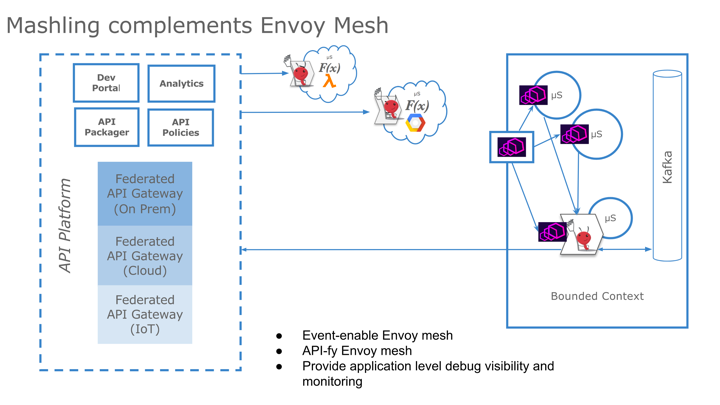

# Mashling integration with lyft/envoy front-proxy

> **Mashling** as a member of the **lyft/envoy** front-proxy mesh
> 
> Project Mashling includes recipes that allow Mashling to be deployed as a member of the Lyft Envoy front-proxy mesh.
> These recipes will bring all the benefits Lyft Envoy will bring to your services around resiliency and observability. 
>In addition, it complements the lyft/envoy-based mesh in the following areas:
>
>- Event-enabling the mesh
>- API-fying the mesh
>- Providing application-level debug visibility and monitoring

## Installation
### Prerequisites
* Docker tools [docker, compose, machine](https://www.docker.com/products/docker-toolbox) 
* Download the Mashling-Gateway Binary for respective OS from [Mashling](https://github.com/TIBCOSoftware/mashling/tree/master#installation-and-usage)

## Getting Started

### Get the source code

	git clone https://github.com/TIBCOSoftware/mashling-recipes
	cd mashling-recipes/recipes/envoy/mashling-envoy-front-proxy
	mkdir gateway

Note:
1)Copy the downloaded mashling-gateway binary into mashling-recipes/recipes/envoy/mashling-envoy-front-proxy folder.

2)If you are trying in linux/ubuntu without VM, use local machine ip instead of $(docker-machine ip default) in subsequent steps. We have verified on linux/ubuntu.

Create a docker-machine

	docker-machine create --driver virtualbox default
	eval $(docker-machine env default)

### Deploy Kafka mashling app in Envoy front-proxy
Please change the **kafka/mashling-kafka-definition.json** file for Kafka cluster details appropriately before running the command to deploy Kafka-based mashling app.

Set the Kafka broker URL according to your setup in the format \<host_ip>:\<port>
	The following example sets the value to 10.98.200.188:9092.
	
	Note:
	
	The envoy service mesh containers will run inside a docker-machine, 
	whereas the Kafka broker will be running outside the docker-machine
	on the host machine. 
	
	A mashling service container will therefore not be able to connect to 
	a Kafka broker using 'localhost:9092' as the broker url. The host IP will 
	enable the connection from the mashling consumer, running inside the service 
	mesh, to the Kafka broker.

#### Command
	$jdoe-machine:front-proxy jdoe$ pwd
	/Users/jdoe/front-proxy

	$jdoe-machine:front-proxy jdoe$ export KAFKA_BROKER_URL=10.98.200.188:9092
	$jdoe-machine:front-proxy jdoe$ ./createKafkaMashlingOnEnvoy.sh 
	
This will create a sample mashling app named 'kafka-mashling-app' under /Users/jdoe/front-proxy/gateway folder.
 
This will also create an envoy front-proxy setup with the 'kafka-mashling-app' as a member of the envoy mesh.

The 'kafka-mashling-app' app will consume the Kakfa topic 'users'.

You can check the message ingress into mashling consumer by doing the following:

1. Find the service2 container

>docker ps | grep service2

|CONTAINER ID| IMAGE | COMMAND | CREATED | STATUS | PORTS | NAMES |
|---|---|---|---|---|---|---|
|__54c3d57b5ce1__| mashlingenvoyfrontproxy_service2|"/bin/sh -c /usr/l..."|2 minutes ago|Up 25 seconds|       80/tcp|mashlingenvoyfrontproxy_service2_1|

2. Tail the logs for the selected container
>docker logs -f __54c3d57b5ce1__

   Note: In linux/ubuntu, if you encounter server misbehaving error. Stop the kafka server and zookeeper server. Open file 
   KAFKA-HOME/config/server.properties.
   Check for listeners section and uncomment the line. Edit the line with system ip 
   listeners=PLAINTEXT://System-IP:9092.
   Start zookeeper and kafka server.

### Deploy a HTTP mashling app in Envoy front-proxy
#### Command
	$jdoe-machine:front-proxy jdoe$ pwd
	/Users/jdoe/front-proxy
	
	$jdoe-machine:front-proxy jdoe$ ./createHttpMashlingOnEnvoy.sh 
	
This will create a sample mashling app named 'http-mashling-app' under /Users/jdoe/front-proxy/gateway folder.
 
This will also create an envoy front-proxy setup with the 'http-mashling-app' as a member of the envoy mesh.

The 'http-mashling-app' app will expose the endpoint (/pets/1)

Access the mashling service (service3) behind the proxy as
> curl -v $(docker-machine ip default):8000/pets/1

### Changes in the Envoy front-proxy for a non-sample mashling app

Please make sure that the mashling-envoy.json file reflects the HTTP filter routes corresponding to your mashling API endpoint. The default app exposes '/pets/:petId' on port 9096.

The front-envoy.json file should be changed accordingly to keep APIs consistently documented. The default app is configured with the front-envoy.json given the '/pets' prefix.

### Test directly using docker-compose

You can also get the envoy mesh up and running with docker-compose directly.

> docker-machine create --driver virtualbox default

> eval $(docker-machine env default) 

For HTTP sample,
> echo "MASHLING_NAME=sample" > .env
> 
> echo "ROOT_DIR=$(pwd)" >> .env && env $(cat .env | xargs) docker-compose -f docker-compose.yml -f http/docker-compose-http.yml up --build -d

or Kafka sample,
> echo "MASHLING_NAME=kafka-users-consumer" > .env
> 
> echo "ROOT_DIR=$(pwd)" >> .env && env $(cat .env | xargs) docker-compose -f docker-compose.yml -f kafka/docker-compose-kafka.yml up --build -d

Check the processes
> docker-compose -f docker-compose.yml -f kafka/docker-compose-http.yml ps

> 		Name                		State     Ports     
>---                
>		frontproxy_front-envoy_1     Up       0.0.0.0:8000->80/tcp, 0.0.0.0:8001->8001/tcp 
>		frontproxy_service1_1        Up       80/tcp                                       
>		frontproxy_service2_1        Up       80/tcp                                       

Access service1 as
> curl -v $(docker-machine ip default):8000/service/1

Access mashling service (service3) behind the proxy as
> curl -v $(docker-machine ip default):8000/pets/1
 

## Adding a new mashling app into the mesh

Mashling is an event-driven microgateway application that can work with a variety of triggers such as REST, KAFKA and MQTT etc. For more info on mashling [see](https://github.com/TIBCOSoftware/mashling)

Mashling apps can consume events such as REST endpoint invocation or a message delivered on a KAFKA topic. As a result, deploying a mashling app into the L7 proxy framework such as Lyft/Envoy needs some configuration.

### Mashling microgateway app using an HTTP trigger
A mashling microgateway app that uses an HTTP trigger can potentially expose multiple rest endpoint routes that front different backend microservices.

When such mashling app is deployed on Envoy front-proxy service mesh, we need to consider each rest endpoint exposed by the mashling app and decide whether it needs to be exposed through the envoy front-proxy. If we decide to expose a rest endpoint through envoy front-proxy, we need to create/change the following code artifacts:

1. Make a copy of the http-mashling-envoy.json. The new file is, e.g., acme-mashling-envoy.json
2. Change the routes configuration in the acme-mashling-envoy.json file according to the rest endpoint(s) that your mashling microgateway exposes. Relevant file section is given below

		   "route_config": {
              "virtual_hosts": [
                {
                  "name": "service",
                  "domains": ["*"],
                  "routes": [
                    {
                      "timeout_ms": 0,
                      "prefix": "/pets",
                      "cluster": "local_service"
                    }
                  ]
                }
              ]
            },

3. Change the cluster information section in the acme-mashling-envoy.json according to the ports your service endpoints work with. Relevant file section is given below
	
		"cluster_manager": {
		    "clusters": [
		      {
		        "name": "**local_service**",
		        "connect_timeout_ms": 250,
		        "type": "strict_dns",
		        "lb_type": "round_robin",
		        "hosts": [
		          {
		            "url": "tcp://127.0.0.1:9096"
		          }
		        ]
		      }
	    ]
	  }
4. Open the front-envoy.json file and add your new service routes alongside the other routes. Relevant file section is given below 
		              
		"virtual_hosts": [
        {
              "name": "backend",
              "domains": ["*"],
              "routes": [
                {
                  "timeout_ms": 0,
                  "prefix": "/service/1",
                  "cluster": "service1"
                },
                {
                  "timeout_ms": 0,
                  "prefix": "/service/2",
                  "cluster": "service2"
                },
                {
                  "timeout_ms": 0,
                  "prefix": "/pets",
                  "cluster": "service3"
                }
              ]
            }
          ]
        },
5. Also add your cluster in the cluster manager section in the front-envoy.json. Relevant file section is given below

			  "cluster_manager": {
			    "clusters": [
			      {
			        "name": "service1",
			        "connect_timeout_ms": 250,
			        "type": "strict_dns",
			        "lb_type": "round_robin",
			        "features": "http2",
			        "hosts": [
			          {
			            "url": "tcp://service1:80"
			          }
			        ]
			      },
			      {
			        "name": "service2",
			        "connect_timeout_ms": 250,
			        "type": "strict_dns",
			        "lb_type": "round_robin",
			        "features": "http2",
			        "hosts": [
			          {
			            "url": "tcp://service2:80"
			          }
			        ]
			      },
			      {
			        "name": "service3",
			        "connect_timeout_ms": 250,
			        "type": "strict_dns",
			        "lb_type": "round_robin",
			        "hosts": [
			          {
			            "url": "tcp://service3:80"
			          }
			        ]
			      }
			    ]
			  }

6. Add the new service entry in the docker-compose-http.yml. Use acme-mashling-envoy.json in mounting the file volume. Make other relevant changes for alias, env variable etc. Relevant file section is given below

		  service3:
		    build:
		      context: .
		      args:
		        - MASHLING_NAME
		      dockerfile: Dockerfile-mashling
		    volumes:
		      - ./mashling-envoy.json:/etc/service-envoy.json
		    networks:
		      envoymesh:
		        aliases:
		          - service3
		    environment:
		      - SERVICE_NAME=3
		    expose:
		      - "80"

7. Run **docker-compose up --build -d** to spin up new sandbox with your service running as a member of the envoymesh.
8. That's it! 
 

## License
mashling is licensed under a BSD-type license. See TIBCO LICENSE.txt for license text.

lyft/envoy is licenced under Apache-2.0 license.
