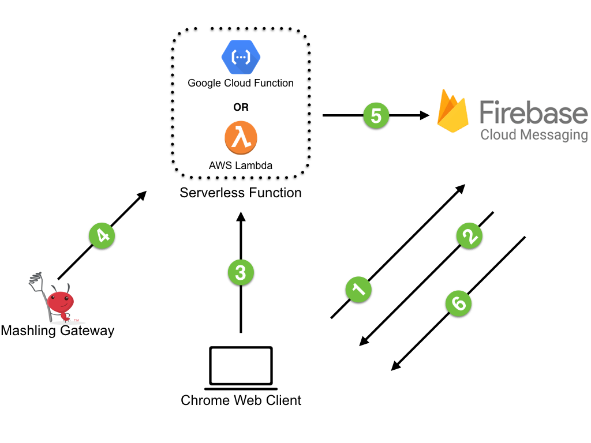

# Mashling Push Notifications using Firebase

This recipe demonstrates how **Mashling** can send push notifications to its registred desktop chrome clients using Firebase.

Pictorial representation of the recipe solution:

* STEP 1: Open Mashling push notification web application using Chrome.
* STEP 2: Chrome web application (Client) registers itself with FCM.
* STEP 3: FCM generates registration id for the client.
* STEP 4: Client application stores registration id in Firebase Realtime Database.
* STEP 5: Mashling triggers push notification by invoking cloud function.
* STEP 6: Cloud function retrives client registration ids from Firebase Realtime Database, Notification message from Mashling request and invokes FCM to send push notification.
* STEP 7: FCM sends push notification to clients & Client shows notification to user.

## Getting Started

Please follow below steps based on where you want to deploy serverless function:
* Using [AWS Lambda](/recipes/fcm/mashling-fcm-push-notifications/using_aws_lambda.md)
* Using [Google Cloud Function](/recipes/fcm/mashling-fcm-push-notifications/using_google_function.md)

## License
mashling is licensed under a BSD-type license. See TIBCO LICENSE.txt for license text.

fcm-project and aws-lambda-project licenced under Apache-2.0 license.