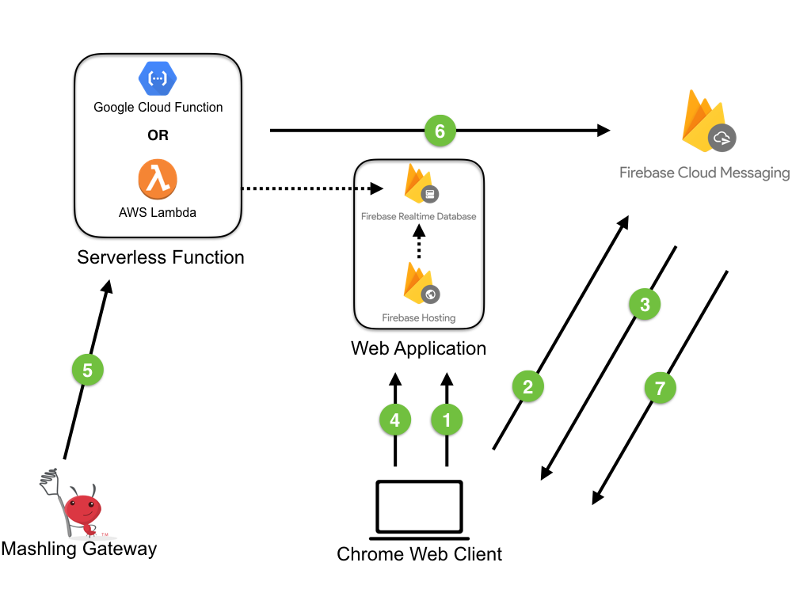

# Mashling Push Notifications using FCM

This recipe demonstrates how **Mashling** can send push notifications to its registred desktop chrome clients using Firebase.

Pictorial representation of the recipe solution.

* STEP 1: Chrome web application (Client) registers itself with FCM.
* STEP 2: FCM generates registration id for the client.
* STEP 3: Client application sends registration id to serverless function.
* STEP 4: Mashling triggers push notification by invokding cloud function.
* STEP 5: Cloud function invokes FCM to send push notifications to registred users by providing notification payload + client registration ids.
* STEP 6: FCM sends push notification to clients & Client shows notification to user.

## Getting Started

Please follow below steps based on where you want to deploy serverless function:
* Using [AWS Lambda](/recipes/fcm/mashling-fcm-push-notifications/using_aws_lambda.md)
* Using [Google Cloud Function](/recipes/fcm/mashling-fcm-push-notifications/using_google_function.md)

## License
mashling is licensed under a BSD-type license. See TIBCO LICENSE.txt for license text.

fcm-project is licenced under Apache-2.0 license.