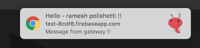

# Mashling Push Notifications using FCM

This recipe demonstrates how **Mashling** can send push notifications to its registred desktop chrome clients using Firebase. This solution can be easily extended to other clients like - Android, iOS, etc.

Pictorial representation of the recipe solution.

* STEP 1: Chrome web application (Client) registers itself with FCM.
* STEP 2: FCM generates registration id for the client.
* STEP 3: Client application sends registration id to cloud function.
* STEP 4: Mashling triggers push notification by invokding cloud function.
* STEP 5: Cloud function invokes FCM to send push notifications to registred users by providing notification payload + client registration ids.
* STEP 6: FCM sends push notification to clients & Client shows notification to user.

## Installation
### Prerequisites
* Node.js SDK [npm, node](https://nodejs.org/en/download/)
* Firebase account [fcm](https://firebase.google.com/)

## Getting Started
Solution consists of two projects.
* fcm-project - Node.js based project consists of 3 modules.
    * Web application - Based on FCM hosting service. It provides browser based user interface through which user can subscribe to receive push notifications from Mashling gateway.
    * Database - Based on FCM realtime database. Responsible for maintaining registred users & Mashling followers records.
    * Cloud function - Based on FCM Functions. When it is invoked, It sends push notifications to registered users using FCM messaging service.
* gateway-project - Mashling gateway descriptor with one HTTP trigger & FCM cloud function invoke handler.

### Source code
    git clone https://github.com/TIBCOSoftware/mashling-recipes
	cd mashling-recipes/recipes/fcm/mashling-fcm-push-notifications

### Deploy FCM project

1. Create a Firebase Project using the [Firebase Console](https://console.firebase.google.com/).
2. Enable Google Provider in the Auth section (Firebase Console -> Authentication -> SIGN-IN METHOD).
3. Navigate to fcm-project directory by running: `cd fcm-project`.
4. You must have the Firebase CLI installed. If you don't have it install it with `npm install -g firebase-tools` and then configure it with `firebase login`.
5. Configure the CLI locally by using `firebase use --add` and select your project (created in step-1) in the list.
6. Install dependencies locally by running: `cd functions; npm install; cd -`
7. Deploy your project using `firebase deploy`
8. Capture `Hosting URL` & cloud `Function URL` from the console. 
Screenshot for reference:

### Create Mashling gateway

1. Navigate to gateway-projct directory `cd ../gateway-project/`
2. Update `endPoint` value in gateway.json with cloud `Function URL` captured in previous section.
3. Create Mashling gateway by running `mashling create -f gateway.json gateway`.

## testing

1. Open `Hosting URL` in Chrome browser.
2. Login with your google account.
3. Accept security confirmation to receive notifications.
4. Enable `Mashling gateway push notifications` preference.
5. Run the Mashling gateway app by using `cd gateway/bin; ./gateway`
6. Open another terminal & Perform HTTP POST call using  
`
curl -X POST localhost:9096/notification -d '{"messageType":"push","message":"Message from gateway !!"}'
`
7. You should see desktop nofication when chrome browser window is minimized. 
Notification screenshot for reference: 

## License
mashling is licensed under a BSD-type license. See TIBCO LICENSE.txt for license text.

fcm-project is licenced under Apache-2.0 license.