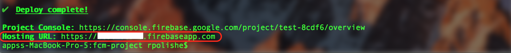
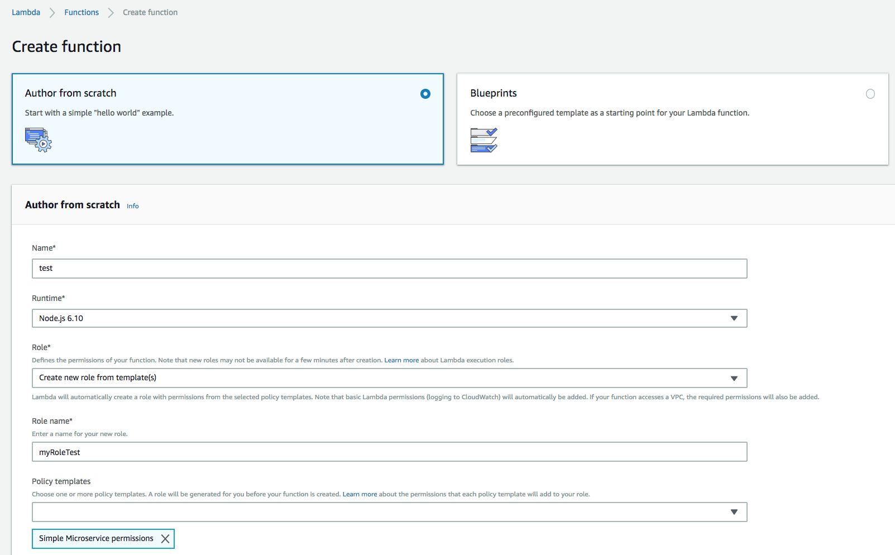

## Installation
### Prerequisites
* Node.js SDK [npm, node](https://nodejs.org/en/download/)
* Firebase account [fcm](https://firebase.google.com/)

## Getting Started
Solution consists of three projects.
* fcm-project - Node.js based project consists of 2 modules.
    * Web application - Based on FCM hosting service. It provides browser based user interface through which user can subscribe to receive push notifications from Mashling gateway.
    * Database - Based on FCM realtime database. Responsible for maintaining registred users & Mashling followers records.
* aws-lambda-project - It is an AWS Lambda serverless function. When it is invoked, It sends push notifications to registered users using FCM messaging service.
* gateway-project - Mashling gateway descriptor with one HTTP trigger & FCM cloud function invoke handler.

### Source code
    git clone https://github.com/TIBCOSoftware/mashling-recipes
	cd mashling-recipes/recipes/fcm/mashling-fcm-push-notifications

### Deploy FCM project

1. Create a Firebase Project using the [Firebase Console](https://console.firebase.google.com/).
2. Enable Google Provider in the Auth section (Firebase Console -> Authentication -> SIGN-IN METHOD).
3. Navigate to fcm-project directory by running: `cd fcm-project`.
4. You must have the Firebase CLI installed. If you don't have it install it with `npm install -g firebase-tools` and then configure it with `firebase login`.
5. Configure the CLI locally by using `firebase use --add` and select your project (created in step-1) in the list.
6. Install dependencies locally by running: `cd functions; npm install; cd -`
7. Deploy your project using `firebase deploy --only hosting,database`
8. Capture `Hosting URL` from the console. 
Screenshot for reference:

### Deploy AWS Lambda

1. Navigate to aws-lambda-project's lambda function - sendPushNotification directory `cd ../aws-lambda-project/functions/sendPushNotification`
2. Install dependencies locally by running: `npm install`
3. Edit index.js by updating Firebase project access credentials (`projectId, clientEmail, privateKey and databaseURL`).  
Firebase project credentials can be generated from [Firebase console](https://console.firebase.google.com/) -> Your Firebase Project -> Service Accounts tab -> Firebase Admin SDK section -> Generate New Private Key  
databaseURL can be found at - [Firebase console](https://console.firebase.google.com/) -> Your Firebase Project -> Database page -> Get started -> Realtime database
4. Create a deployment package by using zip utility `zip -r ../sendPushNotification.zip .`
5. Login to https://aws.amazon.com/console/ and navigate to Services -> Lambda -> Create function with name `test`
Screenshot for reference:

6. Upload function package - sendPushNotification.zip under configuration tab -> select "test" function -> Function code -> Code entry type -> select dropdown "Upload a .ZIP file"
Note: Increase function Timeout 1 min to avoid time-out issues.

### Create Mashling gateway

1. Navigate to gateway-projct directory `cd ../../../gateway-project/`
2. Create Mashling gateway by running `mashling create -f gateway_lambda.json gateway_lambda`.

## Testing

1. Open `Hosting URL` in Chrome browser.
2. Login with your google account.
3. Accept security confirmation to receive notifications.
4. Enable `Mashling gateway push notifications` preference.
5. Set AWS IAM user access credentials as environment variables. `export access=AWS_ACCESS_KEY` AND `export secret=AWS_SECRET_KEY`
6. Run the Mashling gateway app by using `cd gateway_lambda/bin; ./gateway_lambda`
7. Open another terminal & Perform HTTP POST call using  
`
curl -X POST localhost:9096/notification -d '{"messageType":"push","message":"Message from gateway !!"}'
`
8. You should see desktop nofication when chrome browser window is minimized. 
Notification screenshot for reference: 

