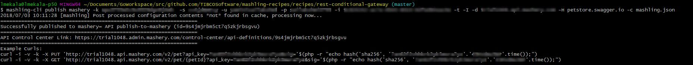

# Publish to Mashery Recipe

This is a recipe to publish the HTTP triggers in the gateway json file into Mashery.

## Prerequisites
* Assuming user has mashery account with key, secret and areaId 

Instructions:

* Place the rest-conditional-gateway.json in a folder and create the API package using below command

```bash
mashling-cli publish mashery -k KEY -s SECRET_KEY -u USERNAME -p PASSWORD -i UUID -d <PORTAL_FULLY_QUALIFIED_DOMAIN_NAME> -H HOST -c rest-conditional-gateway.json

```

The PORTAL_FULLY_QUALIFIED_DOMAIN_NAME is a fully qualified domain name for a public endpoint (i.e. Traffic Manager). The fully qualified domain name should be something like "foobar.api.mashery.com".

For more details about the various switches, run:

```bash
mashling-cli publish mashery -help
```

* To create API package, IO docs and developer keys update the above command with "-t -I" flags and run it

* Output from the mashling-cli publish mashery commnad 
* Execute the example curl request by updating petId. 

    a) If response is 200 OK, gateway is working as expected <br>
    b) If response is 403 Forbidden, mashery admin user has to provide access for API definition and API Package to respective user.

* Access mashery admin portal and update the IO DOCS-> auth section as follows

```
    "key": {
           "param": "Key_Secret _Timestamp_Hash_(SHA-256)",
           "location": "query",
           "secret": {
               "param": "sig",
               "type": "signed_sha256"
           }
       }
```

* Access mashery developer portal and test the application.