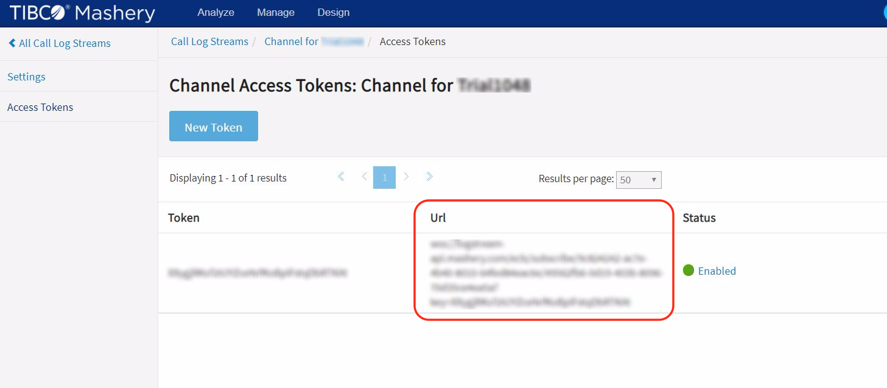

# Mashery websocket log events analyzer
This recipe is a gateway opens a websocket connection to Mashery log streaming service, parse each log message and creates an event in case of an error log.

## Installation
* Download the mashling-gateway binary for respective OS from [Mashling](https://github.com/TIBCOSoftware/mashling/tree/master#installation-and-usage)

## Setup

* Download the recipe
```bash
git clone https://github.com/TIBCOSoftware/mashling-recipes
cd mashling-recipes/recipes/websocket-eventing
```
* Place the downloaded mashling-gateway binary in websocket-eventing folder
* Configure Mashery log streaming service url in the gateway config file [websocket-eventing -> triggers -> settings].

```json
"settings": {
    "url": "wss://<MASHERY_LOG_STREAM_URL>"
}
```
Note: logs streaming url can be found in your Mashery admin console.



* Create sendgrid account from [here](https://signup.sendgrid.com/). Login to your sendgrid account and get the [API-KEY](https://app.sendgrid.com/settings/api_keys) and place it in gateway config file.
```json
"Authorization": "Bearer <YOUR_SENDGRID_API_KEY>"
```
* Update gateway config file with your email address.
```json
"email": "<EMAIL_ADDRESS>"
```
## Testing

Start the gateway:

```bash
./mashling-gateway -c websocket-eventing.json
```

Consume Mashery hosted APIs when backend services are not available, you should observe from the gateway logs that `LogService` has been called.